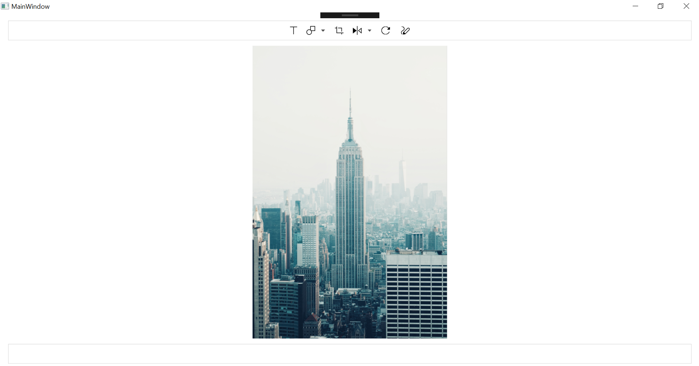

# How-to-keep-only-the-default-toolbar-items-in-WPF-SfImageEditor

This article explains how to disable the toolbar items except the default toolbar items such as text, shape, rotate, flip, crop and path in Syncfusion WPF SfImageEditor. 

It can be achieved by using the custom image editor and overriding the OnApplyTemplate method to disable the toolbar items as shown in the following code snippet.

**[XAML]**

```
        <local:CustomEditor x:Name="editor" ImageSource="CustomViewImage1.png">
        </local:CustomEditor>
```        

**[C#]**

```
    public class CustomEditor : SfImageEditor
    {
        public override void OnApplyTemplate()
        {
            base.OnApplyTemplate();
            var items = this.ToolbarSettings.ToolbarItems.Count;
            var border = this.Template.FindName("PART_HeaderToolbarPanel", this) as       Border;
            var panel = (border.Child as Grid).Children[0] as StackPanel;
            var browseButton = panel.Children[0] as Button;
            var saveButton = panel.Children[1] as Button;
            var line = panel.Children[2] as Rectangle;
            var undoButton = panel.Children[3] as Button;
            var redoButton = panel.Children[4] as Button;

            var grid = (border.Child as Grid).Children[1] as Grid;
            var stackPanel = grid.Children[0] as StackPanel;
            var SelectButton = stackPanel.Children[0] as Button;
            var panButton = stackPanel.Children[1] as Button;
            var line1 = stackPanel.Children[2] as Rectangle;

            var resetButton = this.Template.FindName("PART_ResetIcon", this) as Button;

            var bottomToolbar = this.Template.FindName("PART_FooterToolbarPanel", this) as Border;
            var bottomPanel = bottomToolbar.Child as Grid;
            var resetZoomButton= bottomPanel.Children[0] as Button;
            var line2 = bottomPanel.Children[1] as Rectangle;
            var decreaseZoomRect = bottomPanel.Children[1] as Rectangle;
            var decreaseZoomButton = bottomPanel.Children[2] as Button;
            var slider = bottomPanel.Children[3] as Slider;
            var increaseZoomButton = bottomPanel.Children[4] as Button;
            var text = bottomPanel.Children[5] as TextBlock;

            browseButton.Visibility = Visibility.Collapsed;
            saveButton.Visibility = Visibility.Collapsed;
            line.Visibility = Visibility.Collapsed;
            undoButton.Visibility = Visibility.Collapsed;
            redoButton.Visibility = Visibility.Collapsed;
            SelectButton.Visibility = Visibility.Collapsed;
            panButton.Visibility = Visibility.Collapsed;
            line1.Visibility = Visibility.Collapsed;
            resetButton.Visibility = Visibility.Collapsed;

            resetZoomButton.Visibility = Visibility.Collapsed;
            line2.Visibility = Visibility.Collapsed;
            decreaseZoomButton.Visibility = Visibility.Collapsed;
            decreaseZoomButton.Visibility = Visibility.Collapsed;
            increaseZoomButton.Visibility = Visibility.Collapsed;
            slider.Visibility = Visibility.Collapsed;
            text.Visibility = Visibility.Collapsed;
        }
    }
```
**Output:**

 
KB article - [How-to-keep-only-the-default-toolbar-items-in-WPF-SfImageEditor](https://www.syncfusion.com/kb/12194/how-to-keep-only-the-default-toolbar-items-in-wpf-sfimageeditor)

**See also**

[How to enable/disable the toolbar visibility](https://help.syncfusion.com/wpf/image-editor/toolbar-customization#visibility)

[How to add the additional items to the toolbar](https://help.syncfusion.com/wpf/image-editor/toolbar-customization#add-a-item)

[How to customize the height of toolbar](https://help.syncfusion.com/wpf/image-editor/toolbar-customization#customization-1)
